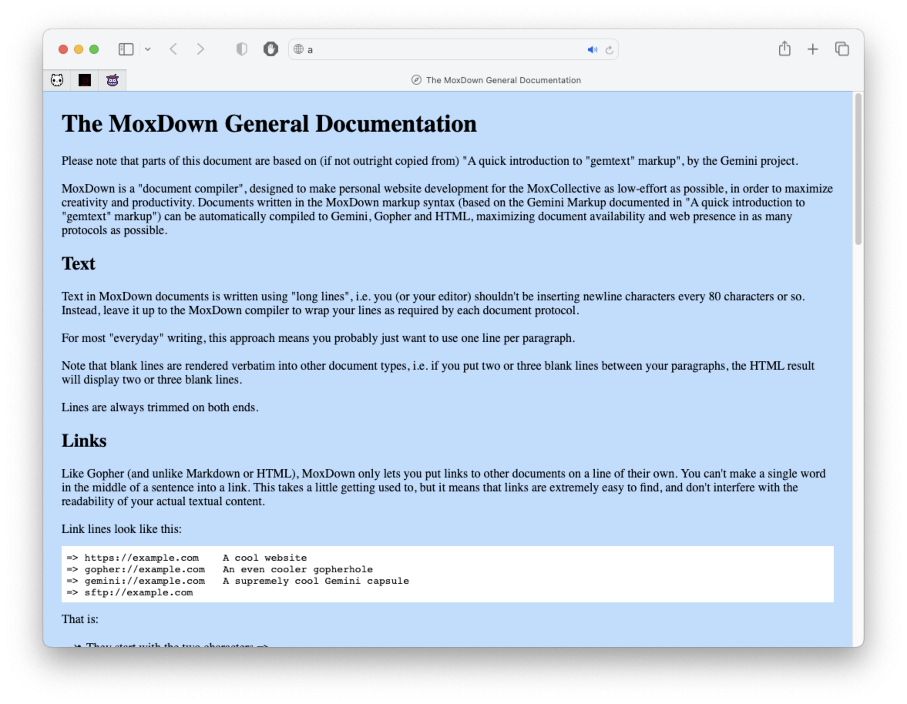

# MOXDown
An HTML, Gopher and Gemini file generator.

The idea is that you write .mox files written in MoxDown markup and then this script generates HTML, Gopher and Gemini files from that source.

Check `example.mox` for more an example. You can compile it to HTML, Gopher and Gemini by running:

`python3 MOXDown.py example.mox -g127.0.0.1 -p70 -cblack -lblue -v#ff00aa -b#bbddff -u❧ -k☞`



# The MoxDown General Documentation

Please note that parts of this document are based on (if not outright copied from) "A quick introduction to "gemtext" markup", by the Gemini project.

MoxDown is a "document compiler", designed to make personal website development for the MoxCollective as low-effort as possible, in order to maximize creativity and productivity. Documents written in the MoxDown markup syntax (based on the Gemini Markup documented in "A quick introduction to "gemtext" markup") can be automatically compiled to Gemini, Gopher and HTML, maximizing document availability and web presence in as many protocols as possible.

## Text

Text in MoxDown documents is written using "long lines", i.e. you (or your editor) shouldn't be inserting newline characters every 80 characters or so. Instead, leave it up to the MoxDown compiler to wrap your lines as required by each document protocol.

For most "everyday" writing, this approach means you probably just want to use one line per paragraph.

Note that blank lines are rendered verbatim into other document types, i.e. if you put two or three blank lines between your paragraphs, the HTML result will display two or three blank lines.

Lines are always trimmed on both ends.

## Links

Like Gopher (and unlike Markdown or HTML), MoxDown only lets you put links to other documents on a line of their own. You can't make a single word in the middle of a sentence into a link. This takes a little getting used to, but it means that links are extremely easy to find, and don't interfere with the readability of your actual textual content.

Link lines look like this:

```
=> https://example.com    A cool website
=> gopher://example.com   An even cooler gopherhole
=> gemini://example.com   A supremely cool Gemini capsule
=> sftp://example.com
```

That is:

* They start with the two characters =>,
* followed by optional whitespace (spaces or tabs, as many or as few as you like),
* followed by a URL (any protocol you like).
* They can end right there if you like, as per the sftp example above!
* Or they can be followed by at least one space or tab,
* And then a human-friendly label, which can be as long as you like.

In the above example, all the URLs and labels lined up nicely because the author was pedantic. But MoxDown doesn't care, and this is fine too:

```
=>https://example.com A cool website
=>gopher://example.com      An even cooler gopherhole
=> gemini://example.com A supremely cool Gemini capsule
=>   sftp://example.com
=> mox://filename.mox A Mox file within this same site!
```

## Headings

MoxDown supports three levels of headings. Headings are limited to a single line and start with either one, two or three # symbols followed by one mandatory space character:

```
# Heading

## Sub-heading

### Sub-sub-heading
```

### More Details

This is the only supported heading syntax. Underlining your headings using - or = symbols like in Markdown will not do anything.

## Lists

MoxDown supports unordered lists. Each item in a list is written as a single long line, which begins with a single * symbol followed by one mandatory space character:

```
* Moncholo
* Mario
* Mega
```

Notes:

* This is the only supported list syntax.
* Using - instead of * like in Markdown will not do anything.
* Nested lists are not supported.

## Preformatted Text

MoxDown is carefully designed to be very, very easy to parse and render. MoxDown proceses MoxDown text one line at a time, rendering each line independently of any lines before it or after it, just by peeking at the first few characters of a line to check for something like =>, # , * , etc.

A line which starts with ``` (i.e. with three backticks) tells the client to toggle between its ordinary parsing mode, and "preformatted mode". In preformatted mode, MoxDown don't check whether or not a line is a link or a heading or anything else. They are simply printed as-is.

Preformatted text can be used to include ASCII art, source code, or similar content in a Gemtext document without clients mistakenly interpreting lines as headings, list items, etc. It can also be used to write documents like this one, which explain Gemtext syntax with examples - you're able to see the syntax examples above without your client interpreting them like it normally would because they are rendered in preformatted mode.

When rendering to the Gopher protocol, preformatted lines longer than 63 characters are wrapped.

Preformatted text is always trimmed for linebreaks on both ends.

## Horizontal Rule

MoxDown supports thematic breaks (horizontal rules), that render as an horizontal line or similar characters on supported document formats.

```
---
```

Representation depends entirely on the resulting format. On your current reading format, this displays as:

---

## Images

MoxDown supports images. Images are displayed on their own, on their own line, and aligned to the left of the document. In formats that don't support images, images are replaced by their alt-text. Alt-text is compulsory in MoxDown.

```
(img) mypicture.png   A picture of me and my friends!
```

Image lines start with the (img) characters, then the name of the picture, then the alt-text. Both the alt-text and the picture name are trimmed for whitespace on both ends.


(That's Lolita the Chihuahua!)

=> https://www.instagram.com/lolitathealien/ Lolita the Alien on Instagram
